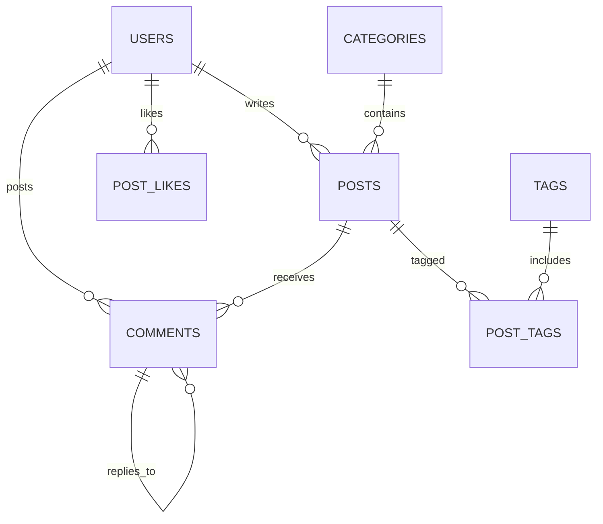

# DevPulse — Modern Blog Platform with Comments

A full-stack blogging platform built with **Python, Flask, SQLite, HTML5, CSS3, and JavaScript (ES6+)** featuring user authentication, post creation & editing, nested comment threads, category filtering, search, and post/comment likes.

---

## 🌟 Key Features

### 🔐 1. User Registration, Authentication & Roles
- **Account Creation & Login**: Secure password hashing using `werkzeug.security`.
- **Session Management**: Session authentication with user context across requests.
- **User Roles**: Supports `user`, `author`, and `admin` roles with role-based access control.
- **Profile Management**: Customize bio, full name, and avatar image.

### 📝 2. Full Article / Post Lifecycle (CRUD)
- **Create Articles**: Rich text editor supporting **Markdown**, cover image URLs, summaries, and category selection.
- **Live Markdown Preview**: Tabbed write/preview mode in the editor.
- **Tag & Category System**: Filter posts by category or tag clouds.
- **Draft & Published States**: Save articles as drafts or publish immediately.
- **Reading Time & Views**: Automatic reading time calculation and real-time view tracking.
- **Edit & Delete Access**: Authors can edit or delete their own posts; admins have full moderation capabilities.

### 💬 3. Interactive Comment System
- **Nested Reply Threads**: Infinite multi-level comment replies (parent-child comment trees).
- **Comment Likes**: Upvote insightful comments.
- **Comment Moderation**: Comment owners, post authors, and admins can remove inappropriate comments.
- **Markdown Support**: Formatted text in comments.

### 🚀 4. RESTful Backend APIs & Database Integration
- **Clean REST Architecture**: Modular endpoints for Auth, Posts, Comments, Categories, Tags, and Dashboard Stats.
- **SQLite Database**: Relational database with foreign key constraints and cascading deletes.
- **Zero Heavy JS Dependencies**: Built using modern native Fetch API, custom CSS design system, and vanilla JavaScript for high performance.

---

## 🛠️ Project Structure

```
blog-platform/
├── app.py                 # Main Flask REST server & routing engine
├── database.py            # SQLite schema definitions & seed data
├── models.py              # Data models & SQL query handlers
├── auth.py                # Authentication logic & session decorators
├── test_platform.py       # Automated unit & integration test suite
├── blog.db                # SQLite database (auto-generated)
├── static/
│   ├── css/
│   │   └── styles.css     # CSS custom variables, theme system, responsive layout
│   └── js/
│       ├── api.js         # REST API HTTP client
│       └── app.js         # Single Page Application controller & DOM bindings
└── templates/
    └── index.html         # HTML5 application shell
```

---

## 🗄️ Database Schema



---

## 📡 RESTful API Reference

### Authentication (`/api/auth`)
- `POST /api/auth/register` — Register a new user account
- `POST /api/auth/login` — Authenticate and start session
- `POST /api/auth/logout` — End session
- `GET /api/auth/me` — Get current user profile
- `PUT /api/auth/profile` — Update user profile details

### Posts (`/api/posts`)
- `GET /api/posts` — List posts (filters: `q`, `category`, `tag`, `author_id`, `status`)
- `GET /api/posts/<id_or_slug>` — Get full post details
- `POST /api/posts` — Create a new post (Auth required)
- `PUT /api/posts/<id>` — Update an existing post (Author/Admin required)
- `DELETE /api/posts/<id>` — Delete a post (Author/Admin required)
- `POST /api/posts/<id>/like` — Toggle post like

### Comments (`/api/comments`)
- `GET /api/posts/<id>/comments` — Get nested comment tree for a post
- `POST /api/posts/<id>/comments` — Add a comment or reply (Auth required)
- `DELETE /api/comments/<id>` — Delete a comment
- `POST /api/comments/<id>/like` — Toggle comment like

### Platform Metadata
- `GET /api/categories` — List categories with article counts
- `GET /api/tags` — List tags with counts
- `GET /api/stats` — Platform overall statistics

---

## ⚡ Quick Start Guide

### 1. Run the Platform Server
Navigate to the `blog-platform` directory and launch `app.py`:

```bash
python app.py
```

### 2. Open in Browser
Open your browser and visit:
`http://127.0.0.1:5000`

### 3. Demo Accounts
You can test out pre-seeded accounts using the quick buttons on the login screen or these credentials:
- **Admin**: `alex_dev` / `admin123`
- **Author**: `sarah_code` / `password123`
- **Author**: `marcus_tech` / `password123`

### 4. Run Automated Tests
```bash
python test_platform.py
```
